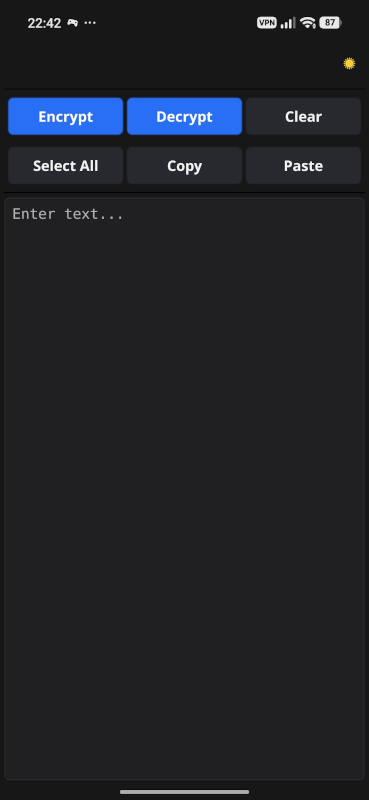
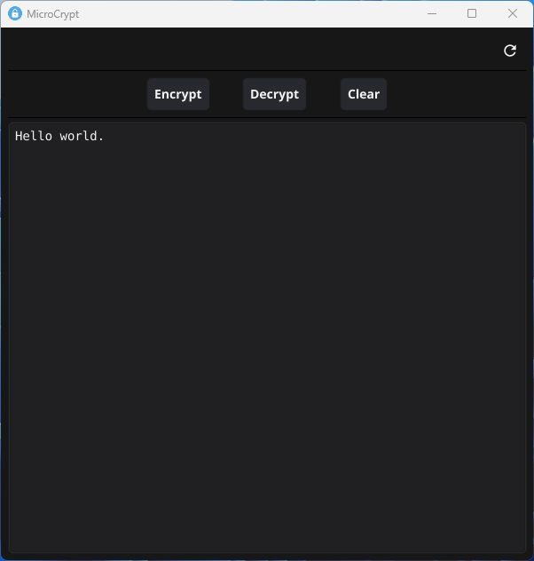

# MicroCrypt

An easy to use symmetric encryption program for Android and PC.

It uses [ISO/IEC 7816-4 padding](https://handwiki.org/wiki/Padding_(cryptography)#ISO/IEC_7816-4) with a muliple of 1KB blocks prior
AES-256-GCM encryption, with an Argon2id protected password, which
must be at least 12 characters Long.


MicroCrypt on Android:  

  

MicroCrypt on PC:  

  

If you like MicroCrypt, as much as I do,  consider a small    
donation in crypto currencies or buy me a coffee.      
```  
BTC: bc1qkluy2kj8ay64jjsk0wrfynp8gvjwet9926rdel  
Nym: n1f0r6zzu5hgh4rprk2v2gqcyr0f5fr84zv69d3x   
XMR: 45TJx8ZHngM4GuNfYxRw7R7vRyFgfMVp862JqycMrPmyfTfJAYcQGEzT27wL1z5RG1b5XfRPJk97KeZr1svK8qES2z1uZrS    
```
<a href="https://www.buymeacoffee.com/Ch1ffr3punk" target="_blank"></a>

MicroCrypt is dedicated to Alice and Bob.
