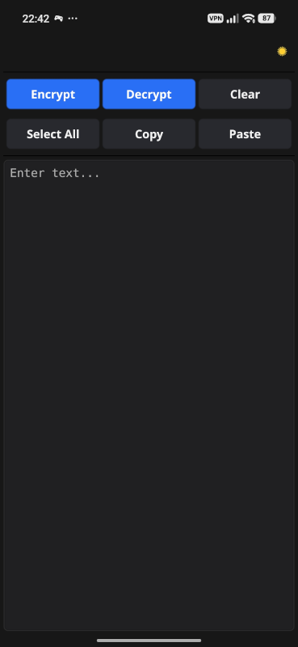

# MicroCrypt

MicroCrypt is a small, cross-platform symmetric encryption tool for    
desktop and mobile devices. It focuses on simplicity, portability,  
and modern cryptographic defaults while avoiding unnecessary metadata  
in encrypted output.    

## Security Considerations  

- **Memory Safety**: MicroCrypt uses `memguard` to securely store  
  sensitive data in locked memory, preventing it from being swapped  
  to disk or appearing in core dumps.    
- **Clipboard Handling**: Copied text is automatically cleared from  
  the clipboard after 15 seconds to prevent data leakage.    
- **Auto-Clear**: The application automatically wipes all sensitive  
  data after 5 minutes of inactivity.    
- **Rate Limiting**: Failed decryption attempts are limited to 5 per  
  minute to prevent brute-force attacks.    

## Features

- Symmetric file encryption using AES-256-GCM    
- Password-based key derivation using Argon2id (OWASP-recommended parameters)    
- ISO/IEC_7816-4 in 1 KB block multiples    
- Minimum 15-character password requirement (NIST 800-63B compliant)    
- Simple graphical interface built with the Fyne toolkit    
- Works on Linux, macOS, Windows, Android and iOS    
- Automatic memory cleanup on inactivity    
- Dark/light theme toggle    

## Cryptography Overview

MicroCrypt uses the following components:  

1. **AES-256-GCM**  
   Provides authenticated encryption, ensuring both confidentiality and    
   integrity of the encrypted data.    

2. **Argon2id**
   A memory-hard password-based key derivation function designed to    
   resist brute-force and GPU-based attacks. Parameters:     
   - Time: 3 passes    
   - Memory: 64 MB    
   - Parallelism: 4 threads    

3. **ISO/IEC 7816-4 Padding**
   Data is padded to 1 KB boundaries before encryption.  
   This helps reduce leakage about the original file size.      

## Encrypted Output Format

MicroCrypt produces a self-contained base64-encoded string containing:    

| Component | Length | Purpose |  
|-----------|--------|---------|  
| Salt | 16 bytes | Prevents rainbow table attacks |   
| Nonce | 12 bytes | Ensures unique ciphertext per encryption |   
| Ciphertext | Variable | AES-256-GCM encrypted data |  

The three components are concatenated and base64-encoded with line breaks     
every 24 characters for easier handling.   

## Use Cases

 MicroCrypt is suitable for:    
 - Encrypting personal files with a simple GUI   
 - Cross-platform workflows where the same tool is needed on desktop and     
   Android or iOS   
 - Users who want strong encryption without complex configuration    
 - Situations where avoiding metadata leakage is important    

 MicroCrypt is not intended for:    
 - Public-key encryption or key exchange Workflows    
 - Enterprise or multi-user key Management    
 - Automated or scripted encryption Pipelines    

Special thanks go to [Maria Sophia](https://newsgrouper.org/comp.mobile.android/1772049649/1772488033) and [Arno Welzel](https://arnowelzel.de/) for their valuable feedback, and to [Ffna Sol](https://www.fiverr.com/ffna_sol) for the MicroCrypt icon design.      

  

If you like MicroCrypt, as much as I do,  consider a small        
donation in crypto currencies or buy me a coffee.         
```  
BTC: bc1qkluy2kj8ay64jjsk0wrfynp8gvjwet9926rdel    
Nym: n1f0r6zzu5hgh4rprk2v2gqcyr0f5fr84zv69d3x     
XMR: 45TJx8ZHngM4GuNfYxRw7R7vRyFgfMVp862JqycMrPmyfTfJAYcQGEzT27wL1z5RG1b5XfRPJk97KeZr1svK8qES2z1uZrS      
```
<a href="https://www.buymeacoffee.com/Ch1ffr3punk" target="_blank"></a>

MicroCrypt is dedicated to Alice and Bob.  
